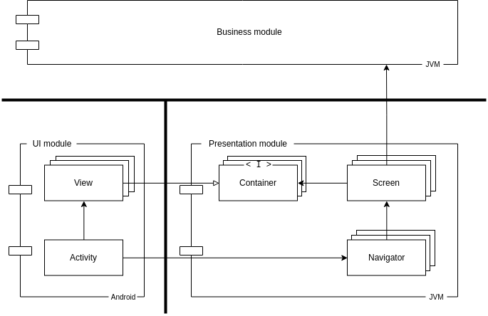

# Acorn

Acorn is a carefully designed library aimed to make navigation in applications
easier.

Navigation on Android is complex, since the default way of navigating through
and using Activities or Fragments severely violate separation of concerns.
This project aims to be able to reclaim this separation by clearly providing a
separation between UI, presentation and navigation.

<p align="center">
  <br>
  
</p>

The core of Acorn consists of two interfaces: `Scene` and `Navigator`.

Scenes represent destinations in the application where the user can navigate to.
Often these are the screens of the application, but they can represent any
navigational node in the application.

Navigators control the navigational state of the application.
They respond to events emitted by Scenes and update the navigational state
accordingly, for example by changing the active Scene.

Coupling to Android, the Activity subscribes to changes in Scenes by the
Navigator, and provides the user interface.

## Extensibility

Acorn is fully extensible.
The core artifacts (`acorn` and `acorn-android`) provide interfaces that are
simple but powerful enough to form a basis for writing the presentation layer
of mobile applications.

The library also provides two base extension artifacts that can be used as a
basis for the presentation layer of your application.  
`ext-acorn` provides default base implementations for working with Scenes and
Navigators.  
`ext-acorn-android` provides a mechanism to couple the Android framework to
your application.

Lastly, there are some helper extension artifacts that provide useful utility
implementations which use external dependencies, such as RxJava or Android
LiveData.

## Setup

Acorn currently only exists as a SNAPSHOT.
Gradle users can add the following line to their `repositories` section:

```groovy
maven { url "https://oss.sonatype.org/content/repositories/snapshots" }
```

You can declare the dependencies as follows, replacing `x.x.x` by the latest
snapshot version:

```groovy
// To get started quickly, add the following artifacts
implementation "com.nhaarman.acorn.ext:acorn:x.x.x-SNAPSHOT"
implementation "com.nhaarman.acorn.ext:acorn-android:x.x.x-SNAPSHOT"
```

As mentioned before, Acorn consists of a core and some extension artifacts.
The core artifacts live in the `com.nhaarman.acorn` group:

|Group| Artifact | Description | Dependencies|
|-----|----------|-------------|-------------|
|`com.nhaarman.acorn`| `acorn` | The core library, containing only the interfaces for Acorn without any functionality. | - |
|`com.nhaarman.acorn`| `acorn-android` | The core library for Android, containing only the interfaces for working with Acorn on Android. | `com.nhaarman.acorn:acorn` |

The extension libraries provide default implementations to the core, and live
in the `com.nhaarman.acorn.ext` group:

|Group| Artifact | Description | Dependencies|
|-----|----------|-------------|-------------|
|`com.nhaarman.acorn.ext`| `acorn` | The main extension on the Acorn core, providing default implementations. |`com.nhaarman.acorn:acorn`|
|`com.nhaarman.acorn.ext`| `acorn-rx` | An RxJava extension for Acorn. |`com.nhaarman.acorn:acorn`|
|`com.nhaarman.acorn.ext`| `acorn-testing` | Provides testing utilities for JVM tests. |`com.nhaarman.acorn:acorn`|
||||
|`com.nhaarman.acorn.ext`| `acorn-android` | The main extension on the Acorn-Android core, providing default implementations. |`com.nhaarman.acorn:acorn`<br>`com.nhaarman.acorn:acorn-android`|
|`com.nhaarman.acorn.ext`| `acorn-android-testing` | Provides testing facilities for instrumentation testing with Acorn-Android. |`com.nhaarman.acorn:acorn`<br>`com.nhaarman.acorn:acorn-android`<br>`com.nhaarman.acorn.ext:acorn-android`|
|`com.nhaarman.acorn.ext`| `acorn-android-timber` | Provides a `TimberLogger` |`com.nhaarman.acorn:acorn`<br>`com.nhaarman.acorn.ext:acorn`|
|`com.nhaarman.acorn.ext`| `acorn-android-lifecycle` | Provides `LifecycleScene` |`com.nhaarman.acorn:acorn`<br>`com.nhaarman.acorn.ext:acorn`|

