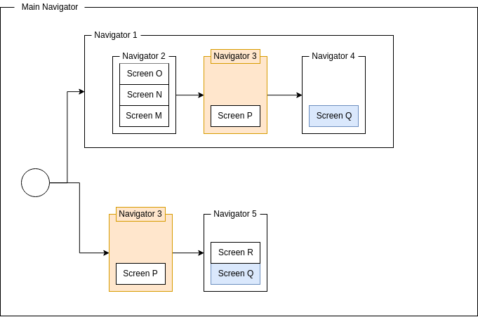

# Application Flow

In a typical mobile application, a user can navigate from one screen to another
and another, which can be regarded as a 'flow' through your application.
The default way of managing a flow is to use a stack of screens where screens
can be pushed on and popped off of, like the Activity back stack or the Fragment
back stack.

### Multiple flows

Often, applications have more than one flow.
Next to the application flow that is usually invoked when your application
starts, there might be an onboarding experience or some login flow the user has
to go through.
Composing or editing content like writing an e-mail can also be regarded as a
flow.
These flows can be conditionally started at the start of the application, or at
any time during the lifetime of the application.
These combined flows make up the main application flow.

A second type of flow is when your app can handle share requests from other
applications, or can be used to fetch a result, like selecting a photo or
contact.
These flows typically act parallel to your main application flow.
When the user finishes this type of flow, the application is finished and the
user returns to the application that started the flow.

### Flow results

Much like screens, flows can have results, like that logged in user from the 
login flow, or the picture the user had selected.
Android's Activity class provides a way of yielding a result with the `setResult`
method.
This method takes a result code - like 'cancelled' or 'ok' - and optionally
some data.
Calling `finish` after `setResult` will return the result to the caller of the
Activity.

## Modelling flows

The default way of managing these flows is to use a stack-like structure.
Navigating to a new screen pushes the screen onto the stack, and pressing the
back button pops it back off the stack.
Next to just pushing and popping screens on and off the stack, one can also do
more complex operations, like replacing the entire stack with a new stack, or
replace the last `x` screens by a new screen.

Working with back stacks like this may work for simple applications, but for
more complex scenarios manipulation of the back stack may become a real hassle.
A flow might require popping two screens after a certain event, may need to pop
back to the root screen, or may have to replace the entire stack as a whole.

### State machines

Another way of modelling flows is by using state machines.
State machines provide a natural way of describing the way a user navigates
through the application.
The nodes of the state machine represent screens, and events such as button
presses represent the edges between the nodes.
Whenever such an event occurs, a state transition may occur based on the current
state of the state machine.

Having a state machine as the model of your flow can greatly decrease complexity
when determining a next screen based on state, or when having to deal with
non-trivial flows.
For example, a screen `B` can result in different subsequent screens depending
on how it is started: either screen `C` or screen `D`
When using a state machine, this screen `B` could be represented by two different
nodes in the state machine (say `B1` and `B2`).
When in state `B2`, the state machine just transitions to `C`; when in state
`B2`, the state machine just transitions to `D`:

## Navigation

Navigation is about how you apply your application flows in your app.
Android's Activity class, which from its origin can be seen as a single screen,
provides its own methods to navigate to a new screen, such as
`startActivity(Intent)`.
When a user selects a product from a products list for example, the Activity can
request to start a new Activity that shows a detail page for the product.
Android will take care of starting the new Activity, which in turn inflates the
proper layout to show.

Managing navigation like this again may work for simple applications, but just 
as with manipulating back stacks, complex requirements can become difficult to 
implement.
Determining the next screen in an application flow may depend on some current
application state for example, or the resulting outcome of an event.

### Navigators

To make this easier, dedicated navigator classes can be used to take the
responsibility of navigation away from the screens.
Instead of a screen manipulating the back stack, or telling a navigation
component to go to screen X, it just finishes with or publishes a result event.
The navigator listens for this result and determines the next action to take in
its navigation flow.
When it makes a transition, it can then in turn publish the resulting new screen
to the interested parties, such as the UI layer.

This way, screens become _real_ composable and reusable blocks that have no
knowledge of the flow they are currently in. 
They can be shared in multiple flows without introducing the complexity of
navigation state in them.

### Navigators as flows

Ultimately, a single navigator can be seen as a single flow in the application,
like a login flow taking the user through several screens.
Since navigators do no have to be tied to the default Activity or Fragment back 
stack, they can implement their own data structures to model their flow.
This could still be a stack, but it can also be an actual state machine or 
something entirely different.

Since a navigator is ultimately simply a class that publishes events of screen 
changes, multiple navigators can be composed to a single Navigator, combining
multiple flows into a single application flow. 
This again makes for composable and reusable navigation blocks that can be
shared in other navigation flows.

Flow results, such as a selected picture or a logged in user become an event, 
much like the screens they host.
An Activity can use this result to notify the system of it, or a composing
navigator can use it to switch to another navigator.

