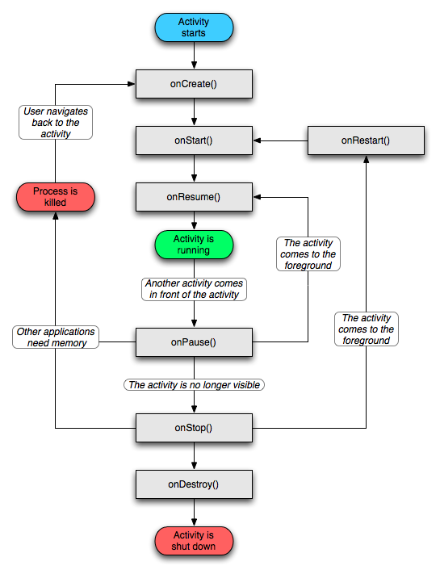

# Mobile Applications

Android applications live in an ecosystem where they can interact with other 
applications, share and receive data, communicate with peripheral sensors, 
and perform background work.
Mobile devices however are still restricted: the network may be slow, and 
there's limited battery and memory available.  
Applications may be killed to free memory for other running applications, or 
may put restrictions on background processing.  
The OS provides developers with the necessary tools to react to and interact 
with the system.

This article reflects on the way mobile applications interact with the system, 
and how they were supposed to be built from the beginning.

_Parts of this article were originally posted on 
[Medium](https://medium.com/@nhaarman/reflecting-on-android-application-development-49c397c7957c)._

## In-app navigation

A typical Android application has more than one screen to present to the user.
A messaging app for example could start with a screen that shows a list of 
message threads. 
By clicking a specific thread, the application navigates to a new screen that 
hows the thread and allows the user to send messages.
From here, the user might even be able to go to a screen that shows the details 
of the contact they're messaging with.
To return to the first screen, the user can simply press the back button a 
couple of times.

In the beginning of Android app development, this was typically done by defining
an Activity for each screen in the application.
The OS starts the ‘main’ Activity when the app is launched, and by navigating 
through the application Activities are pushed and popped off a stack, which is 
where the name ‘back stack’ comes from.
Additionally, developers can use flags when starting Activities to manipulate 
the stack.

Since the applications created back then were simple enough and expectations not
as high as they are now, this formed a good basis to create apps.

## Multitasking and Process Deaths

Multitasking in Android meant that you could switch between apps. 
You could be browsing a webpage and decide to switch to the messaging app to 
send a message, or even get an incoming call and take the call. 
Often this switching between apps resulted in the OS running low on memory, and 
it needs to reclaim some by ending apps that were put in the background. 
When the user navigates back to that app however, he expects the application to 
not have lost its state. 
They could be in the middle of typing a message, or they could have navigated 
all the way down to a screen that displayed details of a product they wanted to 
buy. 
Even within a single application, a large Activity stack could lead to bottom 
Activities being destroyed to reclaim memory.
Losing this state over and over again would result in some very bad user 
experience.

To facilitate this, Android allows Activities to save their state as soon as 
they are put in the background. 
This way, an Activity can store that message the user was typing, and even store 
the exact position of a ListView it was displaying. 
When the OS kills an application to reclaim memory, information about the 
Activity stack and their states are persisted, and when the user returns to the 
application the stack is restored and Activities receive the state they saved.

By default, Android did and does a pretty good job at saving state. 
Activities automatically save the window hierarchy state on onSaveInstanceState. 
You only need to make sure the views that need state saving are reachable from 
the root with all parent views having their ids set.

### Configuration Changes

Usually when an application is put in the background, its Activities are not 
destroyed directly. 
If the user returns to the application when it has not been killed yet, the same 
Activity instances are used and there is no need to restore anything. 
And because of the fact that process death doesn’t happen the majority of times, 
state restoration inevitably takes a back seat.

Android does not only destroy Activities when it needs to reclaim memory 
however. 
Certain system events can require an Activity to be recreated as some 
configuration has changed, like the system language, font size or screen 
orientation. 
These configuration changes often require a new set of resources, which is only 
applied to new Activities. 
The system handles state restoration for configuration changes the same way as 
it does with process death: the new Activity receives the state that was saved 
before the configuration changed happened. 
Obviously, screen rotation does happen fairly often, and it would be detrimental
to the user experience if all state was lost here.

Likewise, when navigating from Activity `A` to Activity `B` in an application, 
Activity `A` _could_ be destroyed rather than being kept in memory. 
When navigating back from `B`, `A`’s state should be properly restored.

## Activities and lifecyles

The Activity class has an extensive set of lifecycle callbacks to let it know 
what is happening in the system. 
Apps and their Activities may have interest in knowing when their focus is lost 
to stop updating the UI, and when it is put in the background to stop doing work
at all.

Now instead of mapping callbacks to functionality, I’d like look at them the 
other way around from an app’s perspective.

During the lifetime of the Activity you generally want to show something to the 
user. 
The Activity provides a window to show a user interface, and you want to inflate
this user interface as soon as the Activity is initialized. 
Since the Activity class is instantiated by the system and needs a bit of 
initialization, it provides the `onCreate` method as a first point where you can 
set up your UI.
Since we’re dealing with process deaths, this is also the place where you 
receive a possible previous saved instance state.

When the Activity has finished `onCreate`, it isn’t visible yet, and you might 
want to do work only when the Activity is visible. 
Android calls this the ‘started’ state, and notifies the Activity by calling 
`onStart`.

In Android, apps can also be visible but not focused; for example when a dialog 
pops up or, in recent versions of Android, you’re dealing with multiple windows. 
In general, the `onResume` method is the one being called when the Activity 
receives focus and interacts with the user[^1].

When starting things, you generally need to stop things as well, and each of 
these ‘entry’ callbacks have their counterparts. 
`onCreate` has `onDestroy`, `onStart` has `onStop`, and `onResume` has 
`onPause`.

It is clear that in the sense of one screen per Activity, the lifecycle is 
primarily used to let the Activity know when to initialize and start work. 
And it’s actually not that difficult at all. 
This simple set of callbacks plus `onSaveInstanceState` should really be all you 
need.

## MV*, Fragments and View-based Libraries

The larger apps grew, the more features they got and with that, more screens.
Testing became more and more important, but was hard and slow due to the tight 
coupling to the system and immensely slow emulator. 
Decoupling application and presenter logic from views meant that test could be 
run on the JVM without having to spin up an emulator, and this decoupling was 
primarily done by using some form of MV*. 
And it wasn’t long after that that libraries began to emerge to facilitate these 
patterns.

Meanwhile Fragments were introduced, "primarily to support more dynamic and 
flexible UI designs on large screens, such as tablets". 
Fragments were supposed to become view controllers to decouple chunks of 
business logic in a single screen. 
A tablet for example could show multiple Fragments, whereas a phone would just 
show a single one.
Activities were still used to go from screen to screen.

With Fragments came the FragmentManager which allowed Fragments to be put on a 
back stack in a single Activity, much like the Activity stack itself. 
Navigating through screens didn’t have to mean you would start another Activity. 
Instead, you just push a new Fragment to the FragmentManager’s back stack and go 
from there. 
There is just one slight downside: the 
[Lolcycle](https://medium.com/square-corner-blog/advocating-against-android-fragments-81fd0b462c97#554b). 
The combined lifecycle of the Activity and a Fragment is almost 
incomprehensible. 
Where previously an asynchronous request would ‘just’ temporarily leak an 
Activity after it was destroyed, now the Fragment would crash if the request was 
finished and you would try to access any resources in it. 
On top of that, the FragmentManager implementation is incredibly difficult to 
follow. 
Fixing bugs in your application just became an all-day job.

### Single Activity Approaches

Fragments did however somewhat encourage developers to build single Activity 
applications. 
It became easier to do transition animations between screens, since there is no 
Activity window in between. 
Not having to deal with Activity flags would also make life a bit easier. 
New libraries emerged to manage a single Activity back stack without using 
Fragments. 
Resources could be passed to new screens directly without having to serialize 
and re-fetch them first.

Using a single Activity approach to host its own back stack of screens makes it 
a bit more difficult though to deal with life cycles and process deaths. 
Instead of just having to handle a single screen per Activity, one must now 
persist the back stack as well, plus all instance states for each of the screens 
in the stack. 
Again, since process death doesn’t happen that often, it inevitably takes a back 
seat. 
More often than not, these libraries didn’t support state restoration as a first 
class citizen.

### Back stacks

The one thing that is persistent throughout the years is the notion of a back 
stack. 
You push screens on it, and you can pop them back off it. 
Sounds simple enough. 
And when you do just that, it really is.  
It becomes difficult though when you need something else. 
You might want to pop 2 screens, or go back to screen A when you’re at screen F, 
or even determine the next screen based on the current state of the back stack. 
All of a sudden, screen F needs to know about the back stack, its state, and the 
screen must be able to manipulate the stack, leading to awkward logic and 
coupling between components.

## Wrapping up

When regarding Activities as screen components, they work great: you get proper
lifecycle callbacks and state restoration to create your apps.
However, the problems that Activities bring with them, such as the destroying of 
Activities on configuration changes and the lack of control regarding transition 
animations drives developers towards other means of structuring their 
applications.

The rest of the pages in the [Background section](index) provide insight into
the way applications _can_ be structured, so that they can be built with 
modularity and testability in mind.

---

[^1]: Actually, onWindowFocusChanged is recommended to know for certain that the Activity is visible to the user. The parameter supplied turns false for example when an AlertDialog is shown, or when the user opens the notification drawer.
