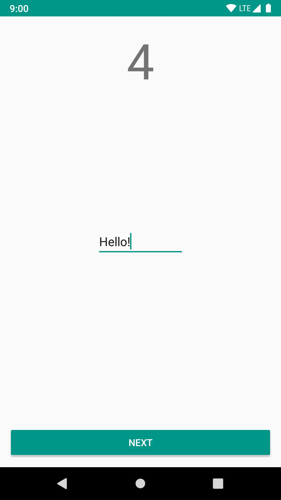

Hello, state restoration!
=========================

This module contains a sample application which shows how you can save and restore
various states in Bravo.
The application allows you to click through several Scenes, each next Scene adding
to a counter.
In addition, each Scene contains an EditText to demonstrate view state saving as
well.

The interesting components in the application:

 - `HelloStateRestorationContainer` and `HelloStateRestorationViewController`

   These are the interface and Android View implementation that will be drawn on
   screen. The ViewController implements `RestorableViewController` which allows
   for saving its hierarchy state automatically.

 - `HelloStateRestorationScene`

   This is the Scene implementation that interacts with the
   `HelloStateRestorationContainer`, and saves both its own and the Container's
   state.

 - `HelloStateRestorationNavigator`

   This is a `StackNavigator` implementation that pushes and pops Scenes on and
   off the stack, and keeps a counter for them.
   This Navigator can save and restore both its own state and the full states of
   all its Scenes.
