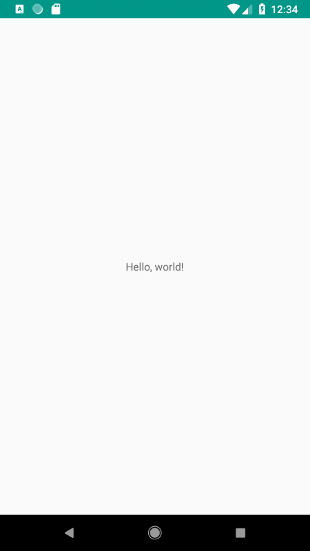

Hello, world!
=============

This module contains an "Hello, world!" example using Bravo, which shows a very simple `TextView` containing the text "Hello, world!".

The application consists of the following components:

 - `HelloWorldContainer` and `HelloWorldView`

   These are the interface and Android view implementation that will be drawn on screen.
   The `HelloWorldContainer` exposes a mutable property that can be modified to show a different text.

 - `HelloWorldScene`

   This is the `Scene` implementation that interacts with the `HelloWorldContainer` to show the "Hello, world!" text.

 - `HelloWorldNavigator`

   This is a very simple `Navigator` implementation that only hosts a single `HelloWorldScene`.

 - `MainActivity`

   The `MainActivity` listens to changes in the `Navigator` and inflates and attaches the layout to the scene.
   Using a `ViewFactory` it binds the `HelloWorldScene` to the proper layout file.

